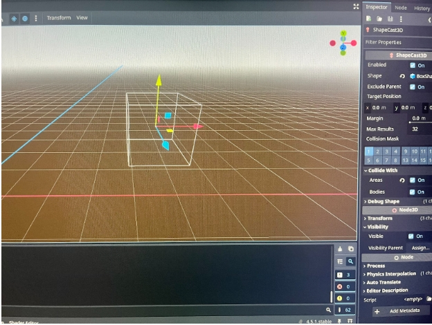
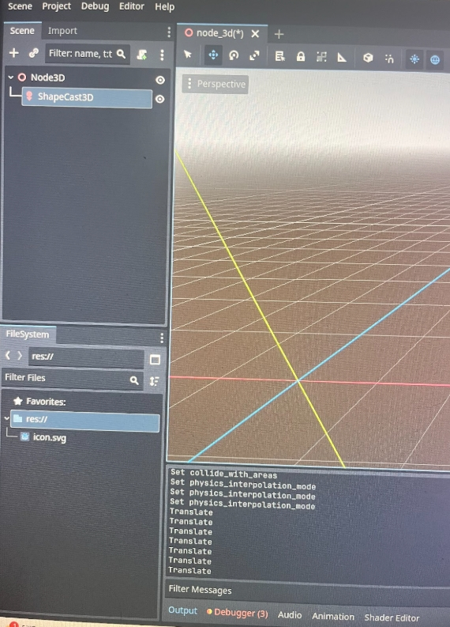
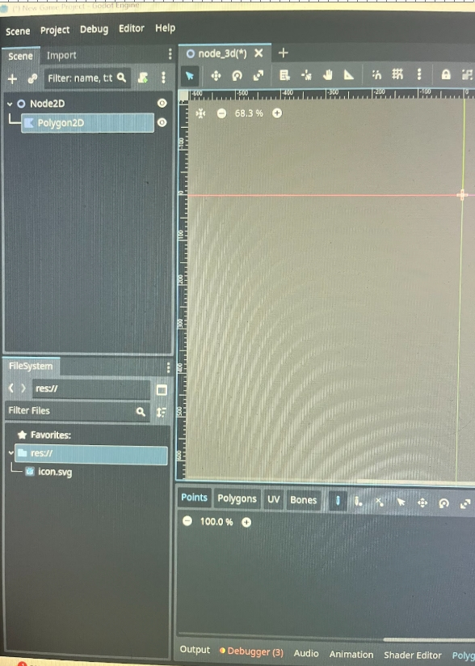
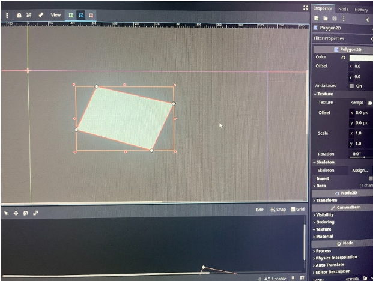
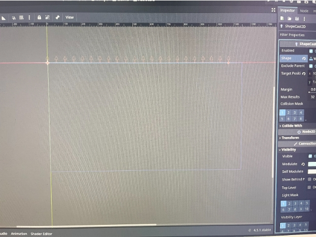
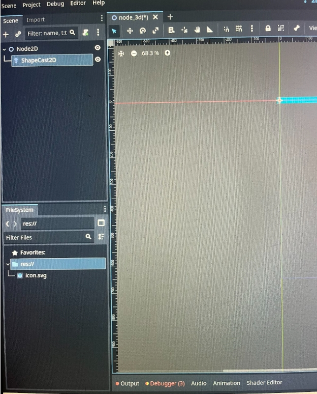

# Entry 1
##### 11/8/25

## context
For this year-long project, I decided to use the tool Godot. Godot is a game engine where you can make 2D or 3D games. My backup tool was Swift, which is another tool for making games on the App Store. After doing my learning logs, I decided to stay with Godot as my tool. The reason I decided on Godot is that it feels just right for my skill level, and when I opened it, I was like booo and excited. For Godot, I was planning on making a racing game and working with Bryan. We just wanted to have fun in our senior year and enjoy life, so we are making a fun game that people can enjoy.

I am making different shapes in both the 3D and 2D models.

## Sources 
First thing, Learning Logs are another tool that I used.[learning log.md](../tool/learning-log.md). This is where I put everything I learned and explain what I did and how I did it. Second, I used many videos [Godot video](https://www.bing.com/videos/riverview/relatedvideo?&q=godot&&mid=06E46AEA6253FB5EBB5F06E46AEA6253FB5EBB5F&&FORM=VRDGAR), [Godot video](https://www.bing.com/videos/riverview/relatedvideo?&q=godot&&mid=842503585F8EDF547044842503585F8EDF547044&&FORM=VRDGAR) and [Last one](https://www.bing.com/videos/riverview/relatedvideo?q=godot&&mid=01A5C13D2D83499014DE01A5C13D2D83499014DE&FORM=VCGVRP). These videos help with getting an understanding of how to use the app and the ways of making games. This is everything I used. I shared this with my teammate so we can understand what each of us should have learned from here.

## EDP 
EDP or Engineering Design Process is the part of the project you are on. I am on the brainstorming and planning part, where I need to think of how I can make a game and find ways to make this game fun, and learn how to drive. 

## skills

### 1. Research
I had to do my research before choosing a tool. I learned a lot about researching, like how to Google well and find what you are looking for. Looking up Godot videos, I couldn't find a lot for people who are starting, but I had to search for more information to find what I was looking for. The Godot app helped me since it provides many links and resources, but you had to look for them.

### 2. Communication
While researching, I've noticed that communication is a very important part because to work together is to communicate. We need to communicate in order to make changes while advancing in technology. Communication is how we share ideas and knowledge. Also, when I needed help, I asked my friends, like I asked Kyle how Godot works at first, and he was able to help me by providing examples and resources. Also, Kyle reminded me to do my Learning Log the 2nd time, as I missed it the 1st time around.

[Next](entry02.md)

[Home](../README.md)
