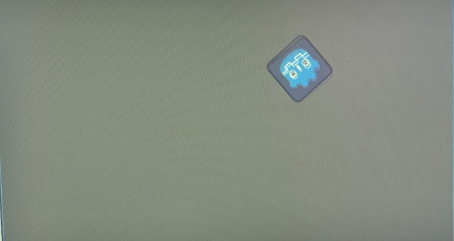
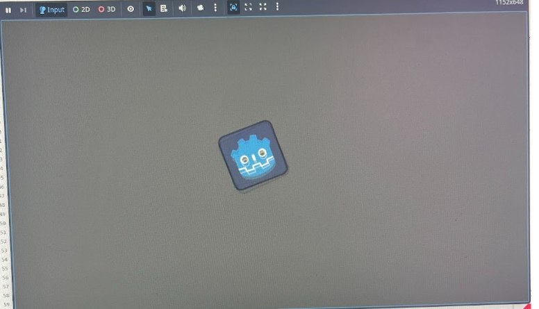

# Entry 2
##### 12/20/2025

## context
For this year-long project, I decided to use the tool Godot. Godot is a game engine where you can make 2D or 3D games. My backup tool was Swift, which is another tool for making games on the App Store. After doing my learning logs, I decided to stay with Godot as my tool. For Godot, I planned to create a racing game and collaborate with Bryan. We just wanted to have fun in our senior year and enjoy life, so we are making a fun game that people can enjoy. So we started talking about what we should do during break and decided that we both will learn more code, do more on Godot, and start making models of the cars that we will be adding. 

##### What I have done
I am making different shapes in both the 3D and 2D models.

So this is what I have been doing, which you can see in the learning logs and how I been learning them.

## Sources 
So one of the tools I used was the Learning Logs.[learning log.md](../tool/learning-log.md). This is where I put everything I learned and explain what I did, and I have added to this each week. Second, I used many videos like [Godot video](https://www.bing.com/videos/riverview/relatedvideo?&q=godot&&mid=06E46AEA6253FB5EBB5F06E46AEA6253FB5EBB5F&&FORM=VRDGAR), [Godot video](https://www.bing.com/videos/riverview/relatedvideo?&q=godot&&mid=842503585F8EDF547044842503585F8EDF547044&&FORM=VRDGAR) and [Last one](https://www.bing.com/videos/riverview/relatedvideo?q=godot&&mid=01A5C13D2D83499014DE01A5C13D2D83499014DE&FORM=VCGVRP). These videos help with getting an understanding of how to use the app and the ways of making games. This is everything I used. I shared this with my teammate so we can understand what each of us should have learned from here.

## EDP 
EDP or Engineering Design Process is the part of the project you are on. I am still on the brainstorming and planning part, where I need to think of how I can make a game, find ways to make this game fun, and learn how to make the game better. 

## skills

##### Break plans 

[Previous](entry01.md) | [Next](entry03.md)

[Home](../README.md)
