# Entry 4: MVP Progress
##### 3/9/26

## context
For this year-long project, I decided to use Godot as my tool. Godot is a game engine for making 2D or 3D games. After doing my learning logs, I decided to stay with Godot as my tool. For Godot, I planned to create a racing game and collaborate with Bryan. We've been talking to each other outside of school and in school about what we have done. Until now, we had a plan for our MVP, and started our prototype, which you can see at the bottom. 

##### What I have done
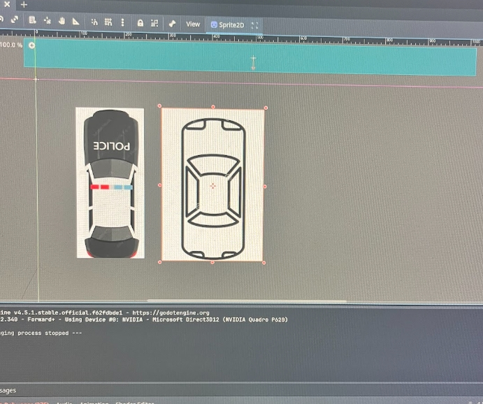
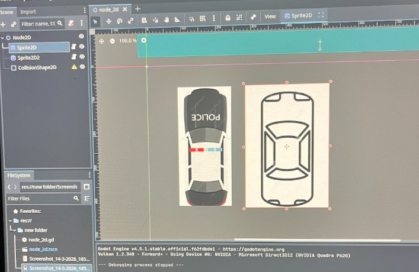
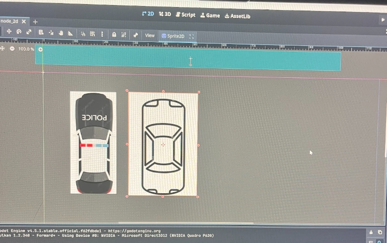
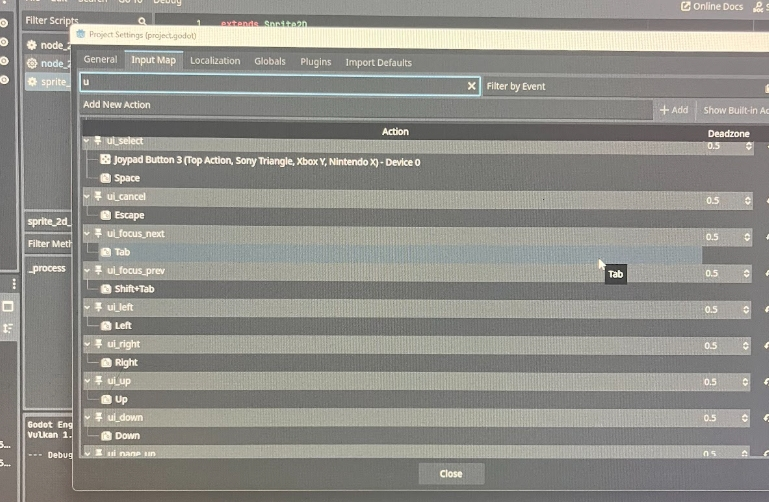
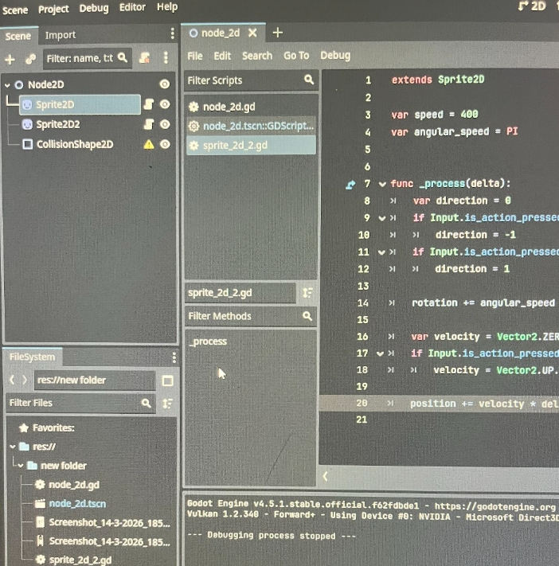
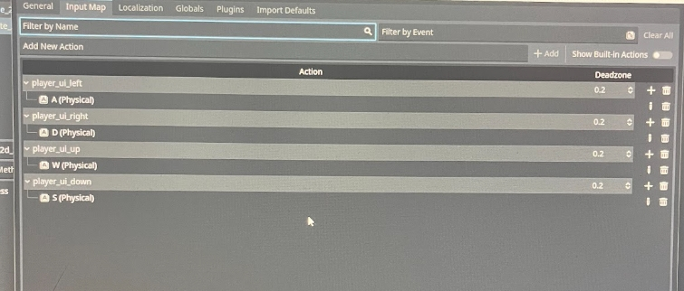
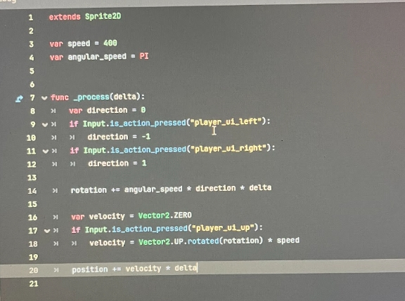
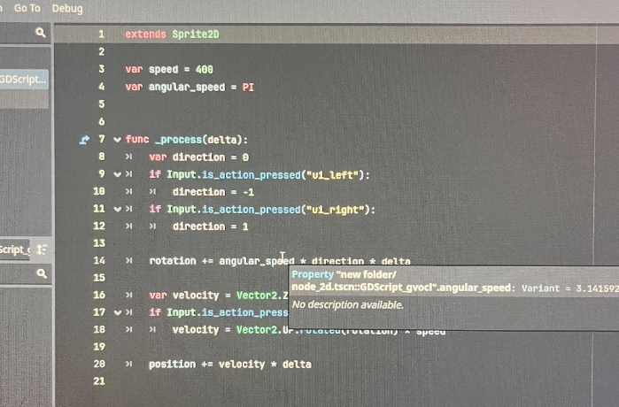
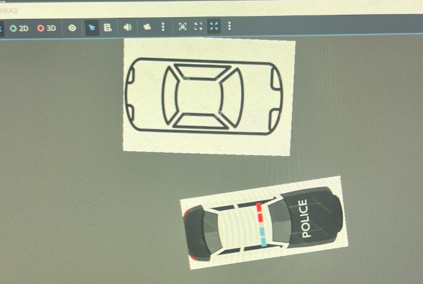
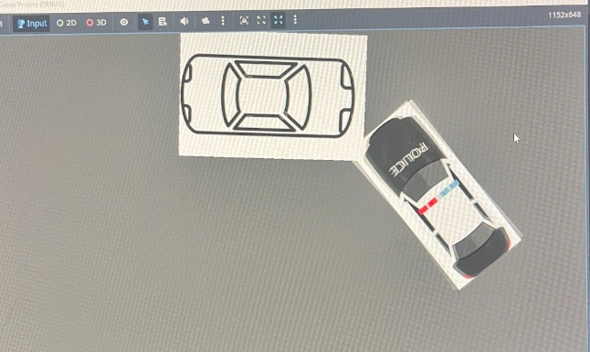
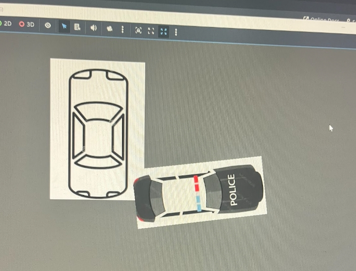
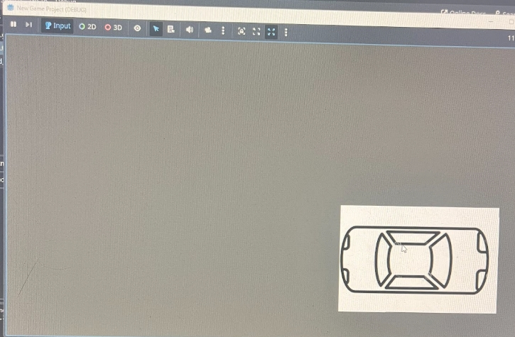

So, as you can see so far, what I have done is change the sprite and made it so there are two players. You can move both players, one with the arrow keys and one with WASD. The way I did this was I changedt he settings of the code to make one WASD and the other arrow keys, which you can see up there. This part was hard as it was my first time doing it, and it took a while. This is what I have done so far. 


## Sources 
So one of the sources I used was the Learning Logs. [learning log.md](../tool/learning-log.md). This is where I compile everything I've learned and explain what I've done, which is updated weekly. Second, I used many videos like [Godot video](https://www.bing.com/videos/riverview/relatedvideo?&q=godot&&mid=06E46AEA6253FB5EBB5F06E46AEA6253FB5EBB5F&&FORM=VRDGAR), [Godot video](https://www.bing.com/videos/riverview/relatedvideo?&q=godot&&mid=842503585F8EDF547044842503585F8EDF547044&&FORM=VRDGAR) and [Last one](https://www.bing.com/videos/riverview/relatedvideo?q=godot&&mid=01A5C13D2D83499014DE01A5C13D2D83499014DE&FORM=VCGVRP). These videos help with getting an understanding of how to use the app and the ways of making games. Last of all, I used AI as a way of giving me videos to watch on something I need, like trying to make it move without Arrows was hard, and I didn't know where to look, so AI told me to change the settings to help me out, which worked. 

## EDP 
EDP or Engineering Design Process is the part of the project you are on. I am still in the prototype phase, this is where I am using the code I learned to make a prototype that works, and after that, we will be fixing the code and making it work better. 
## skills

The skills I learned are the same as last time
1. Research
Research is really important; you get a lot of good information from it. Like when I was researching the tool I was using. I found ways of using it differently and how to connect different tools with it. Also, you need to research more since you get to learn things you wouldn't have if you didn't research. Overall, I think researching is one of the most important parts. 

2. Communication
While researching, I've noticed that communication is a very important part because to work together is to communicate. We need to communicate to make changes while advancing in technology. Communication is how we share ideas and knowledge. Like for the freedom project, I have a partner, so we must communicate, as for this blog, both of us communicated and were talking about what we should do over the week.

3. AI
I have learned one more thing, which is that AI isn't that bad sometimes if you use it for the right things, like asking it questions that can later guide you to the answers you want. Don't use the tool to do it for you, but instead use it to give you ideas and help you out with questions you might have that you couldn't get. So these are the skills I learned so far, and I will be adding more to this on my next blog.

[Previous](entry03.md) | [Next](entry05.md)

[Home](../README.md)

# Process Writeup

## Name: Johnny Yang
## Course: Ap CSA
## Period: 3
## Concept: Unit 8


### Context
So, Unit 8 is about Java and 2D arrays. We learned new codes from the project stem, which is where we have been doing most of our homework and classwork. So overall, in this unit, we just had lessons which we do in class and at home. There was a little lesson this time, but the assignment was hard. 

##### Lesson 1
`````js
public class U8_L1_Activity_One
{

  // Write your sumOfDiag method as described in the assignment
  public static int sumOfDiag(int[][] arr)
  {
    // Initialize Variable
    int sum = 0;
    
    // Add Lead Diagonal
    for (int i = 0; i < arr.length; i++)
    {
      // Validate
      if (i > arr[0].length - 1)
      {
   break;
      }
      sum += arr[i][i];
    }
    
    // End
    return sum;
  }
}

`````
This lesson was about 2D arrays.
##### Lesson 2
````` js
public class TemperatureMonth
{

  private double[][] temperatures;

  public TemperatureMonth(double[][] t)
  {
    temperatures = t;
  }

  public double[] getMaxTempWeekly()
  {
    // Remove return and implement getMaxTempWeekly method here
    double[] week = new double[temperatures.length];
    
    for(int row = 0; row < temperatures.length; row++){
      double maxTemp = temperatures[row][0];
      
      for(int col = 0; col < temperatures[row].length; col++){
        
        if(temperatures[row][col] > maxTemp)
        maxTemp = temperatures[row][col];
      }
      
      week[row] = maxTemp;
    } 
    return week;
  }

  public double[] getMinTempWeekly()
  {
    // Remove return and implement getMinTempWeekly method here
    double[] week = new double[temperatures.length];
    
    for(int row = 0; row < temperatures.length; row++){
      double minTemp = temperatures[row][0];
      
      for(int col = 0; col < temperatures[row].length; col++){
        if(temperatures[row][col] < minTemp)
        minTemp = temperatures[row][col];
      }
      week[row] = minTemp;
    } 
    return week;
  }

  public double getRange()
  {
    // Remove return and implement getRange method here
    double min = temperatures[0][0];
    double max = temperatures[0][0];
    
    for(int row = 0; row < temperatures.length; row++){
      for(int col = 0; col < temperatures[row].length; col++){
        if(temperatures[row][col] < min)
        min = temperatures[row][col];
        if(temperatures[row][col] > max)
        max = temperatures[row][col];
      }
    }
    return max - min;
  }

  public double getCertainTemp(int week, int day)
  {
    // Remove return and implement getCertainTemp method here
    return temperatures[week][day];
  }

}


`````
This is a 2-D Array Algorithm

##### Lesson 3
````` js
import java.io.File;
import java.io.IOException; 
import java.util.Scanner;

public class U8_L3_Activity_One
{
  public static void main(String[] args) throws IOException
  {
    File file = new File("tests.txt");
    Scanner scan = new Scanner(file);
  
    int max = 0;
    int min = 1000;
    int sum = 0;
    int count = 0;
    String maxName = "";
    String minName = "";

    while (scan.hasNext()) 
    {
        String strVal = scan.nextLine();
        String[] val = strVal.split(" ");
        if (Integer.parseInt(val[2]) > max){
          max = Integer.parseInt(val[2]);
          maxName = val[0] + " " + val[1];
        } 
        if (Integer.parseInt(val[2]) < min){
          min = Integer.parseInt(val[2]);
          minName = val[0] + " " + val[1];
        }
        sum += Integer.parseInt(val[2]);
        count++;
    }
    System.out.println("The highest grade is: " + max + " by " + maxName);
    System.out.println("The lowest grade is: " + min + " by " + minName);
    System.out.println("The average grade is: " + ((double)(sum)/(double)(count)));
  }
}

`````
This is using text files.
#####  Assignment 8
````` js
public class Board
{

  private String[][] squares;


  public Board()
  {

    squares = new String[10][10];

    for (int row = 0; row < squares.length; row++)
    {
      for (int col = 0; col < squares[0].length; col++)
      {
        squares[row][col] = "-";
      }
    }
  }


  public String toString()
  {

    String output = "";

    for (int row = 0; row < squares.length; row++)
    {
      for (int col = 0; col < squares[0].length; col++)
      {
        output += squares[row][col] + " ";
      }
      output += "\n";
    }
    return output;
  }


  public boolean addShip(int row, int col, int len, boolean horizontal)
  {

    if (row < 0 || col < 0 || row >= squares.length || col >= squares[0].length)
      return false;

    if (horizontal)
    {

      if (col + len > squares.length)
        return false;
      for (int c = col; c < col + len; c++)
      {
        if (!squares[row][c].equals("-"))
          return false;
      }

      for (int c = col; c < col + len; c++)
      {
        squares[row][c] = "b";
      }
    }

    else
    {

      if (row + len > squares.length)
        return false;
      for (int r = row; r < row + len; r++)
      {
        if (!squares[r][col].equals("-"))
          return false;
      }

      for (int r = row; r < row + len; r++)
      {
        squares[r][col] = "b";
      }
    }

    return true;
  }

  public int shoot(int row, int col)
  {

    if (row < 0 || col < 0 || row >= squares.length || col >= squares[0].length)
      return -1;

    if (squares[row][col].equals("-"))
    {
      squares[row][col] = "m";
      return 0;
    }

    if (squares[row][col].equals("b"))
    {
      squares[row][col] = "x";
      return 1;
    }

    return 2;
  }

  public boolean foundShip(int len)
  {

    for (int row = 0; row < squares.length; row++)
    {

      int count = 0;
      while (count < squares[0].length)
      {

        int foundLen = 0;

        while (count < squares[0].length && squares[row][count].equals("b"))
        {
          foundLen++;
          count++;
        }
        if (foundLen == len)
          return true;

        foundLen = 0;
        count++;
      }
    }

    for (int pos = 0; pos < squares[0].length; pos++)
    {

      int counter = 0;
      while (counter < squares.length)
      {

        int foundLen = 0;

        while (counter < squares.length && squares[counter][pos].equals("b"))
        {
          foundLen++;
          counter++;
        }
        if (foundLen == len)
          return true;

        foundLen = 0;
        counter++;
      }
    }

    return false;
  }

  public boolean gameOver()
  {

    for (int row = 0; row < squares.length; row++)
    {
      for (int col = 0; col < squares[0].length; col++)
      {
        if (squares[row][col].equals("b"))
          return false;
      }
    }

    return true;
  }
}
`````
This is assignment 8, using all the code we learned to make this battleship game.


### Challenges

Having trouble remembering code, there's a lot of code now, after 8 units, I am having trouble remembering the code and how they work. Like the difference between if and while and for loops, these were things I had trouble with. Also, what code to use and when, like if I should do an if or a for loop.

My challenge was that it is hard to focus on senior year, as you don't want to do anything, so I learned to get everything done on time and work hard even if I am tired of life.

### Takeaways
You should always study before an exam or quiz. As when I do, it feels easier, and this time it worked out as this time before the break. I didn't study, and the test was hard, so it didn't work out at the end.

Do all your lessons on time, so I learned that doing all your lessons is a very good thing, as you will miss out on a lot if you don't. So when I was doing the lessons, I made sure I took notes and learned the code, and made sure I did everything on time.


