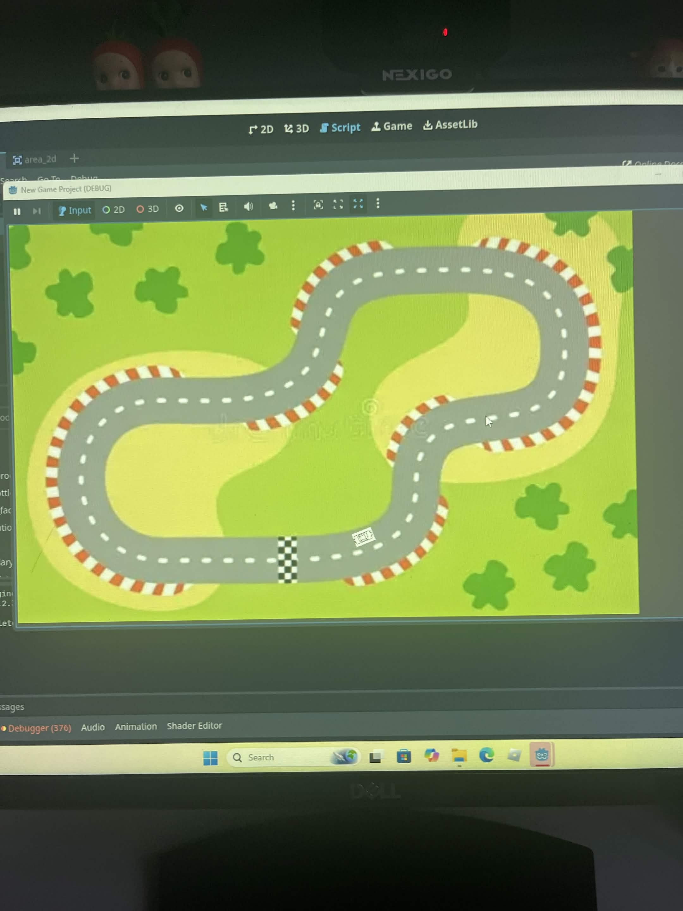
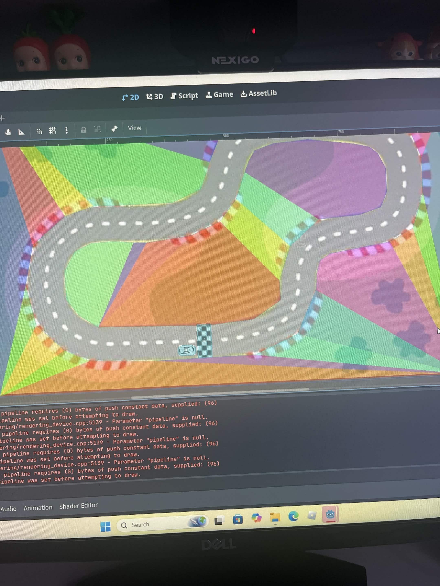
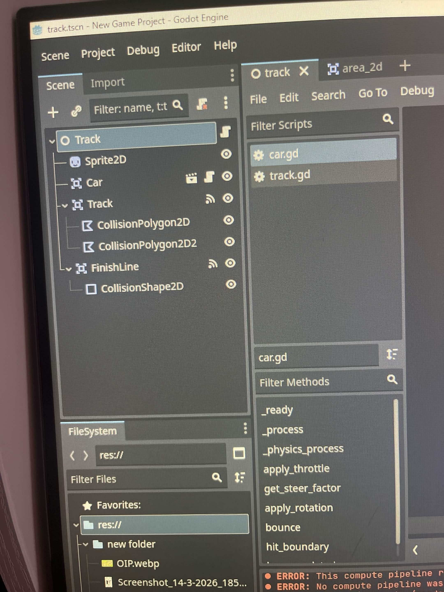
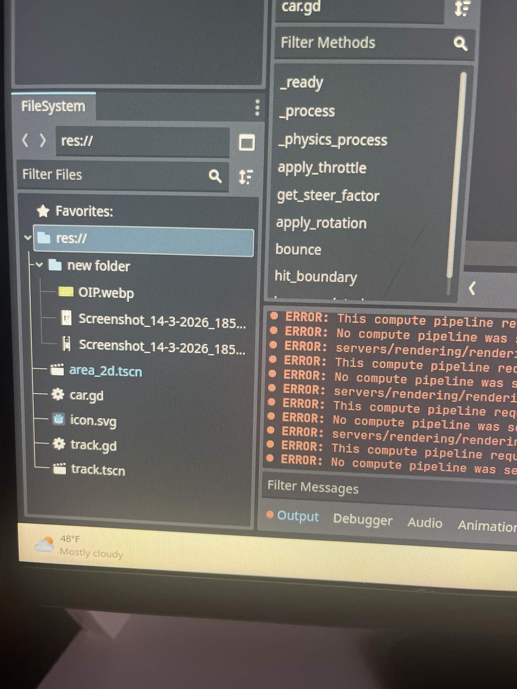

# Entry 5
##### 4/19/2026

## context
For this year-long project, I decided to use Godot as my tool. Godot is a game engine for making 2D or 3D games. After doing my learning logs, I decided to stay with Godot as my tool. My partner and I planned to create a racing game. We decided to use the 2D mode for this on Godot, as we wanted to make a 2D top-down racing game. We've been talking to each other outside of school and in school about what we have done. Until now, we had a plan for our MVP, and started our prototype, which you can see at the bottom. 

##### What I have done, so over the break, I finished my MVP, which you can see below. 

## Sources 
So one of the sources I used was the Learning Logs. [learning log.md](../tool/learning-log.md). This is where I compile everything I've learned and explain what I've done, which is updated weekly. Second, I used many videos like [Godot video](https://www.bing.com/videos/riverview/relatedvideo?&q=godot&&mid=06E46AEA6253FB5EBB5F06E46AEA6253FB5EBB5F&&FORM=VRDGAR), [Godot video](https://www.bing.com/videos/riverview/relatedvideo?&q=godot&&mid=842503585F8EDF547044842503585F8EDF547044&&FORM=VRDGAR) and [Last one](https://www.bing.com/videos/riverview/relatedvideo?q=godot&&mid=01A5C13D2D83499014DE01A5C13D2D83499014DE&FORM=VCGVRP). These videos help with getting an understanding of how to use the app and the ways of making games. Last of all, I used AI as a way of giving me videos to watch on something I need, like trying to make it move without Arrows was hard, and I didn't know where to look, so AI told me to change the settings to help me out, which worked. 

## EDP 
EDP or Engineering Design Process is the part of the project you are on. I am still in the prototype phase, this is where I am using the code I learned to make a prototype that works, and after that, we will be fixing the code and making it work better. 
## skills

The skills I learned are the same as last time
1. Research
Research is really important; you get a lot of good information from it. Like when I was researching the tool I was using. I found ways of using it differently and how to connect different tools with it. Also, you need to research more since you get to learn things you wouldn't have if you didn't research. Overall, I think researching is one of the most important parts. 

2. Communication
While researching, I've noticed that communication is a very important part because to work together is to communicate. We need to communicate to make changes while advancing in technology. Communication is how we share ideas and knowledge. Like for the freedom project, I have a partner, so we must communicate, as for this blog, both of us communicated and were talking about what we should do over the week.

3. AI
I have learned one more thing, which is that AI isn't that bad sometimes if you use it for the right things, like asking it questions that can later guide you to the answers you want. Don't use the tool to do it for you, but instead use it to give you ideas and help you out with questions you might have that you couldn't get. So these are the skills I learned so far, and I will be adding more to this on my next blog.

[Previous](entry04.md) | [Next](entry06.md)

[Home](../README.md)
