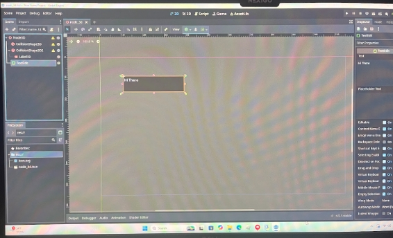
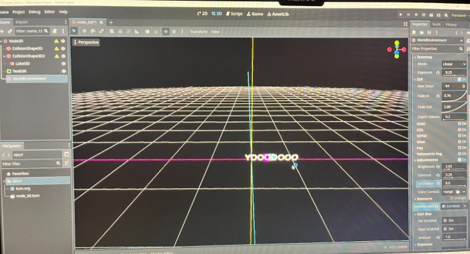
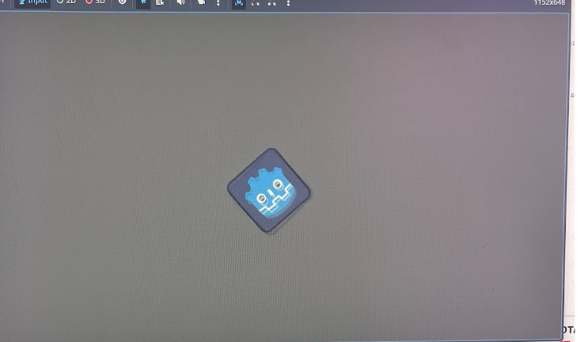
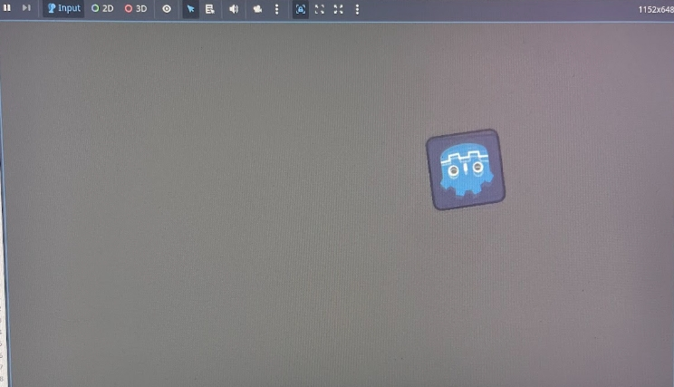

# Tool Learning Log

## Tool: Godot

## Project: Mario cart

---

### 11/2/2025:
So I just started learning about these tools, so at first I went on the website to look around and watched videos. Afterwards, I started playing around with the tool.
I downloaded it to my computer and now:
I am making different shapes in both the 3D and 2D models.


### 11/16/2025:
So, for this week, I planned on tinkering with my tool more, so what I did was add more shapes and learned how to add words to the games. As we can see here:

[](Screenshot_16-11-2025_163633_docs.google.com.jpeg)


So what I did was add words for both 2D and 3D models. So that is what I did for this week's Learning Log.


### 11/23/2025:

So for this week's Learning Log, what I did was change the background and how everything looks. I tinkered with the background and made different backgrounds for the 3D models, and changed the way the things looks:




So this is what I did for this week's learning log. This will come in handy later when I need to change the background of everything and make a different background for our game later.

### 12/7/2025:

This week, I created a spirit and added animation to it.
`````js
extends Sprite2D

var speed = 400
var angular_speed = PI


func _process(delta):
	rotation += angular_speed * delta

	var velocity = Vector2.UP.rotated(rotation) * speed

	position += velocity * delta
`````
This is the code I used, and you can see it's moving.




<!-- 
* Links you used today (websites, videos, etc)
* Things you tried, progress you made, etc
* Challenges, a-ha moments, etc
* Questions you still have
* What you're going to try next
-->
